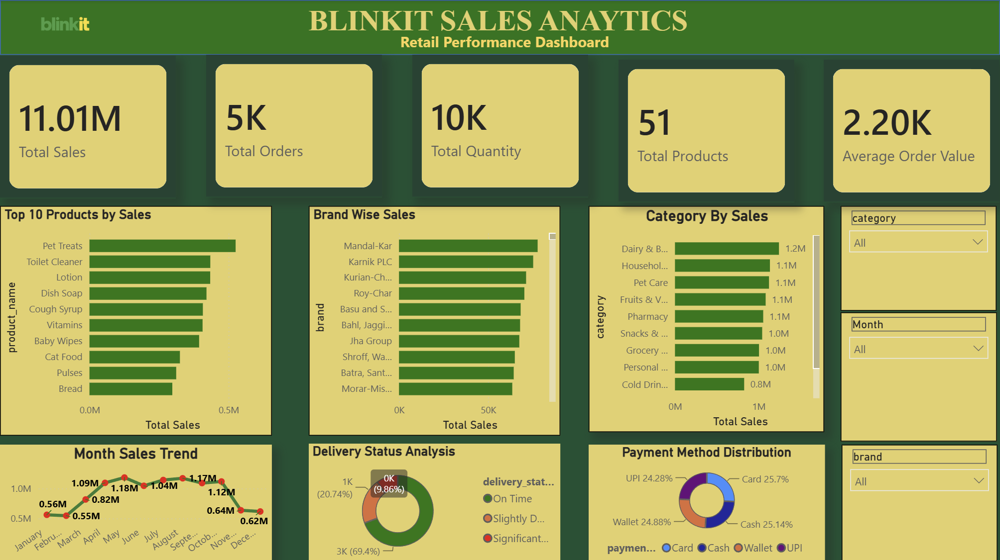

# 🛒 Blinkit Sales Analytics Dashboard

An end-to-end **Data Analytics Project** built using **Python, Pandas, SQL, Excel, and Power BI** to analyze Blinkit's retail sales data and generate actionable business insights.

---

# 📊 Dashboard Preview



---

# 📌 Project Overview

This project analyzes Blinkit's retail sales data to identify trends, monitor KPIs, and generate business insights through an interactive Power BI dashboard.

The project includes:

- Data Cleaning
- Data Preprocessing
- Exploratory Data Analysis (EDA)
- Data Modeling
- KPI Development
- Interactive Dashboard
- Business Insights

---

# 🛠 Tech Stack

- 🐍 Python
- 🐼 Pandas
- 🔢 NumPy
- 🗄 SQL
- 📊 Power BI
- 📈 Microsoft Excel
- 📉 Matplotlib
- 🎨 Seaborn
- 🌿 Git & GitHub

---

# 📈 Dashboard Features

- 💰 Total Sales
- 📦 Total Orders
- 🛒 Total Quantity Sold
- 💵 Average Order Value
- 🏷 Total Products
- 📅 Monthly Sales Trend
- 📊 Category-wise Sales
- 🏪 Brand-wise Sales
- ⭐ Top Products by Sales
- 💳 Payment Method Distribution
- 🚚 Delivery Status Analysis
- 🎛 Interactive Filters

---

# 📊 Key Insights

- Identified monthly sales trends and seasonal demand.
- Analyzed category and brand performance.
- Evaluated customer payment preferences.
- Monitored delivery performance.
- Built KPI-driven business dashboard for decision-making.

---

# 📂 Project Structure

```text
Blinkit-Sales-Analytics/
│
├── dashboard/
│   └── Blinkit_Sales_Dashboard.pbix
│
├── data/
│   ├── raw/
│   └── processed/
│
├── notebooks/
│   └── blinkit_analysis.ipynb
│
├── images/
│   ├── dashboard.png
│   └── logo.png
│
├── reports/
├── sql/
│
├── README.md
├── requirements.txt
└── .gitignore
```

---

# 🚀 Getting Started

## Clone Repository

```bash
git clone https://github.com/shivamakashproj/Blinkit-Sales-Analytics.git
```

## Go to Project Folder

```bash
cd Blinkit-Sales-Analytics
```

## Install Required Libraries

```bash
pip install -r requirements.txt
```

## Open Project

- Open `notebooks/blinkit_analysis.ipynb`
- Open `dashboard/Blinkit_Sales_Dashboard.pbix` in Power BI Desktop

---

# 💡 Skills Demonstrated

- Data Cleaning
- Data Transformation
- Exploratory Data Analysis
- Data Visualization
- Business Intelligence
- Dashboard Development
- KPI Design
- SQL
- Python
- Power BI

---

# 🔮 Future Improvements

- Sales Forecasting
- Customer Segmentation
- Profit Analysis
- Regional Sales Dashboard
- Customer Retention Analysis

---

# 👨‍💻 Author

**Shivam Akash**

- GitHub: https://github.com/shivamakashproj

---

## ⭐ If you like this project, please give it a Star.
